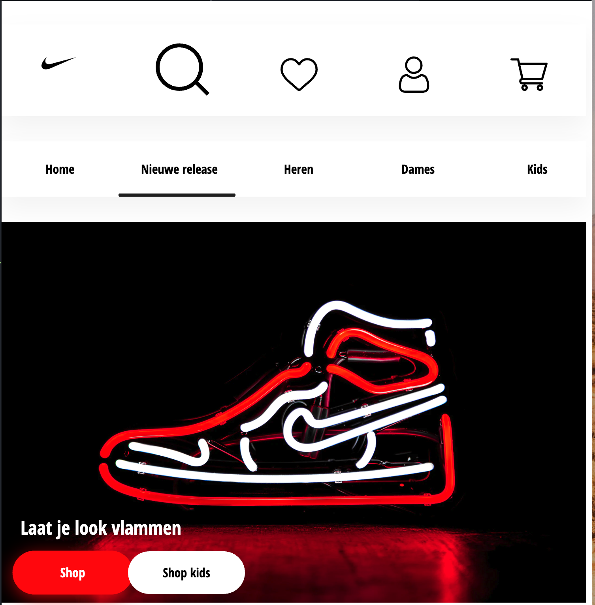
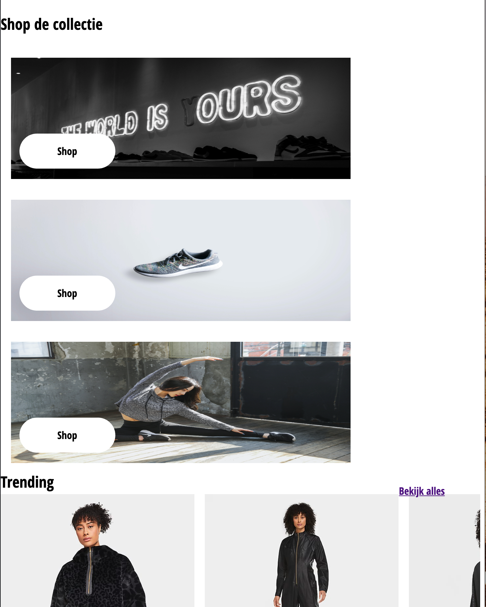
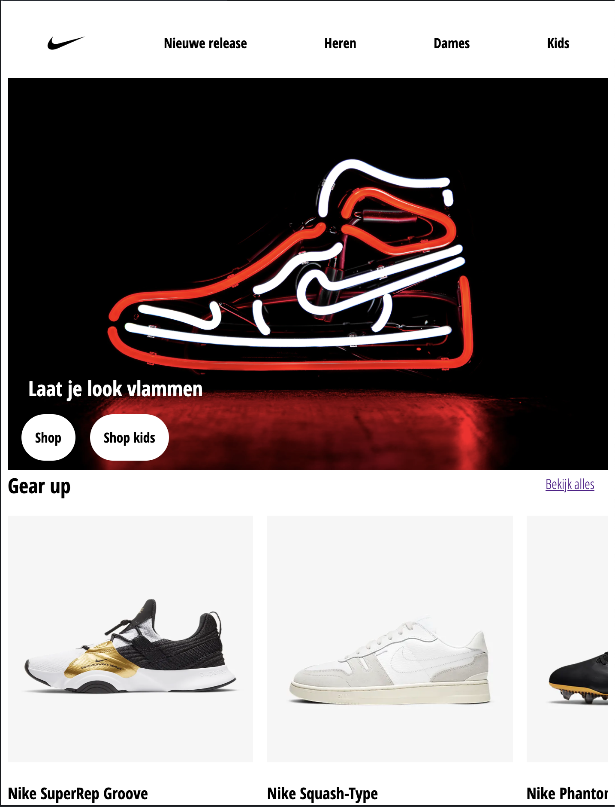
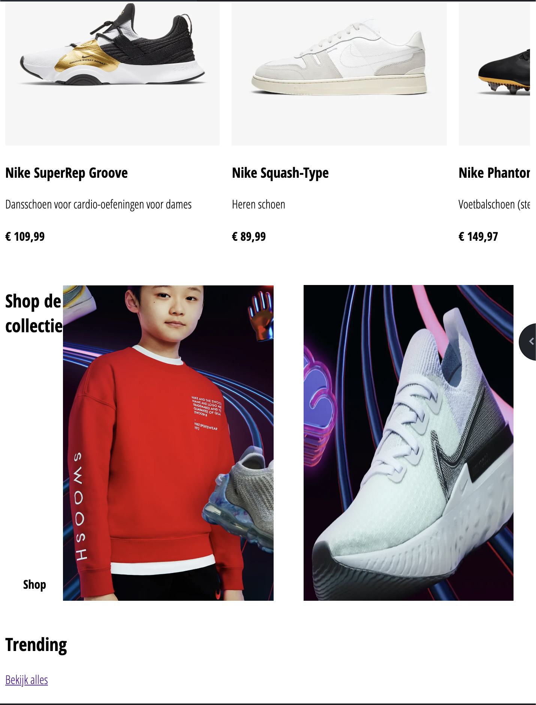
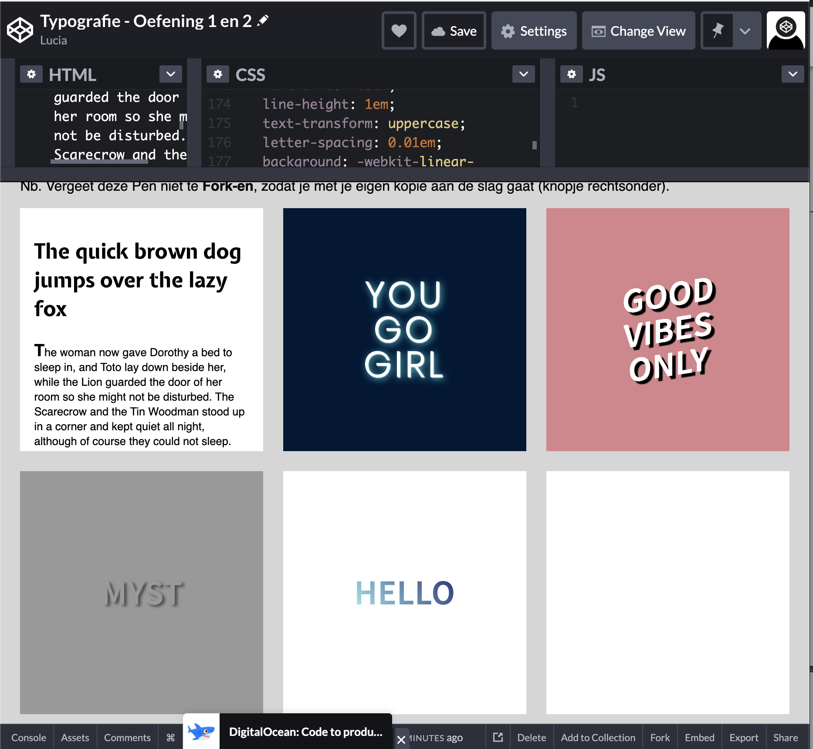
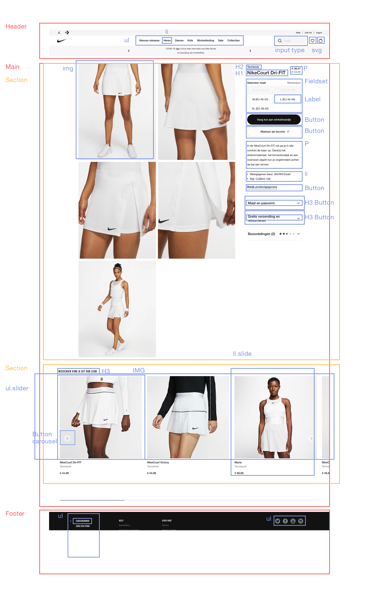
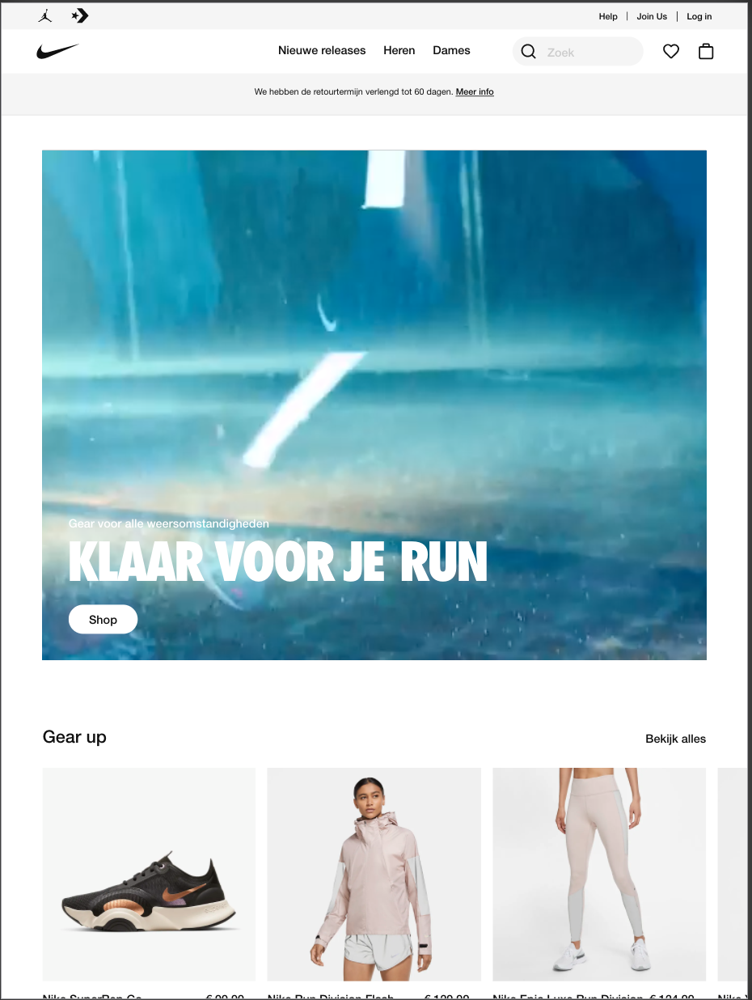
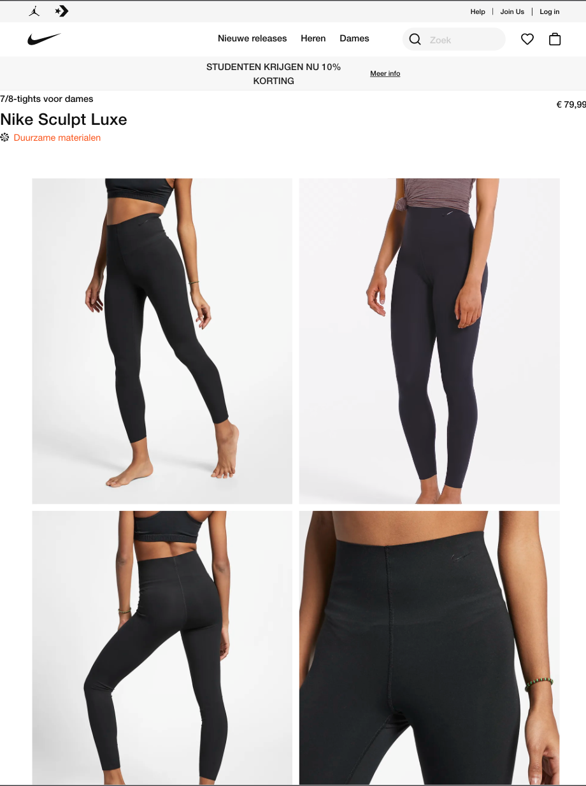

# Procesverslag
**Auteur:** -Lucia van Groningen-

Markdown cheat cheet: [Hulp bij het schrijven van Markdown](https://github.com/adam-p/markdown-here/wiki/Markdown-Cheatsheet). Nb. de standaardstructuur en de spartaanse opmaak zijn helemaal prima. Het gaat om de inhoud van je procesverslag. Besteedt de tijd voor pracht en praal aan je website.

## Bronnenlijst
1. -bron 1-
2. -bron 2-
3. -...-

## Eindgesprek (week 7/8)

-dit ging goed & dit was lastig-

**Screenshot(s):**

-screenshot(s) van je eindresultaat-

## Voortgang 3 (week 6)

-same as voortgang 1-

## Voortgang 2 (week 5)

Dit gaat lastig:
Ik vind het lastig om te beginnen aan de detail pagina. Omdat ik eerst alles netjes en goed werkend wil hebben op de home pagina. Zodat ik die elementen kan overnemen op de detail pagina.

Het is niet op de afbeeldingen te zien. Maar deze week heb ik geprobeerd om mijn menu balk af te krijgen. Door iconen naast elkaar te plaatsen met behulp van flexbox. En er een effect aan toe te voegen met javascript. Daarnaast heb ik mijn buttons vormgegeven met CSS.

### Verslag van meeting

## Voortgang 1 (week 3)

### Stand van zaken

Dit ging goed:
Opdrachten maken en de uitleg gaat goed. Maar het toepassen van de code gaat wat moeizamer.

Dit gaat lastig:
Het neemt echt veel tijd in beslag om de code werkend te krijgen. Ik heb in de afgelopen drie weken veel tijd besteed aan front end. Maar als ik het resultaat zie, vind ik dat nog niet terug zien. Daarnaast vind ik het lastig om flexbox en javascript juist toe te passen.

**Screenshot(s):**

-screenshot(s) van hoe ver je bent met korte uitleg-

Bovenstaande afbeeldingen zijn de homescreen nike.com.
De header heb ik met flexbox en ul  vormgegeven met behulp van codepen oefeningen.

Titel en buttons in de header foto heb ik gepositioneerd met behulp van position absolute en relative.

De onderstaande foto's van schoenen heb ik gepositioneerd met flexbox. Daarover ben ik nog niet tevreden omdat er nu een scrollbar zichtbaar is.

Daaronder staan nog 2 (moeten er 3 zijn) ik krijg het nog niet voor elkaar omdat goed te positioneren met flexbox. Er moet in de lengte 1 afbeelding. Met aan de rechter kant twee afbeeldingen onder elkaar. Daarvoor moet ik nog Guus benaderen voor een tip.

Daarnaast  ben ik er nog niet aan toegekomen om met de volgende pagina aan de slag te gaan. Omdat ik nog achterloop met de home pagina.

### Agenda voor meeting

-samen met je groepje opstellen-

| student 1      | student 2          | student 3    | student 4        |
| ---            | ---                | ---          | ---              |
| dit bespreken  | en dit             | en ik dit    | en dan ik dat    |
| an dat ook nog | dit als er tijd is | nog een punt | dit wil ik zeker |
| ...            | ...                | ...          | ...              |

### Verslag van meeting

**Feedback uit**

- type selector gebruiken ipv class. Lastchild/ first type. (Vooral bij schoen 1, schoen2)
- wees consistent in gebruik van units (em, vm, px)
- maak meer gebruik van cascade overevering (niet dupliceren)
- werk tegelijk aan je detailpagina
- stel javascript niet uit! ⚠️

## Typografie codepen (week1)

## Breakdownschets (week 1)

-uitwerken voor de 1e werkgroep - eind van de eerste week-

 Breakdown schets home pagina van Nike 

 Breakdown schets detail pagina van Nike 

## Intake (week 1)
-uitwerken voor de kick-off werkgroep - begin van de eerste week-

**Je startniveau:** -blauwe piste-

**Je focus:** -responsive-

**Je opdracht:** -https://www.nike.com/nl/-

**Screenshot(s) van de eerste pagina (small screen):**

**Screenshot(s) van de tweede pagina (small screen):**

